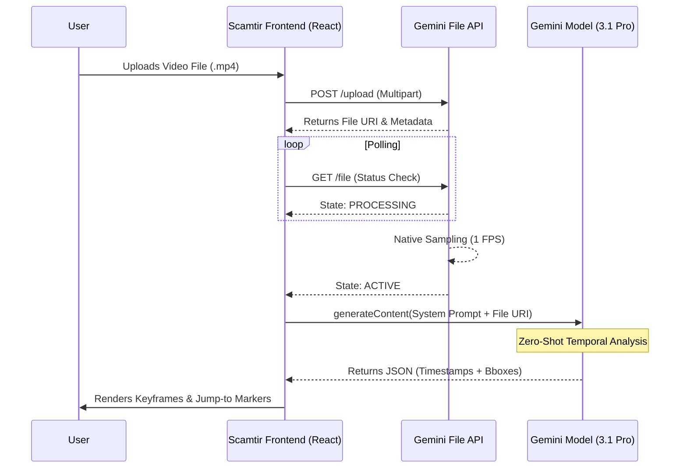
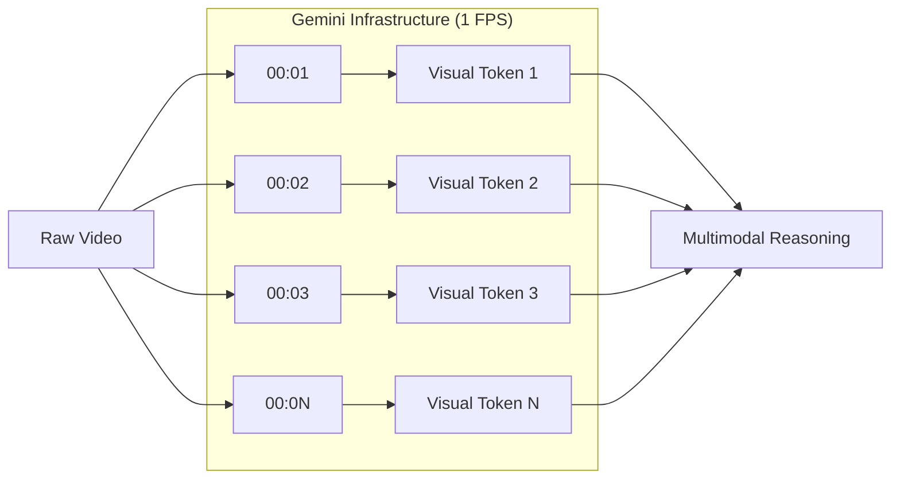

# Scamtir: Gemini Video Intelligence Architecture

This document details the high-performance pipeline used by Scamtir to transform raw video files into searchable, time-stamped visual intelligence using Google Gemini.

## 1. Pipeline Overview
The following diagram illustrates the lifecycle of a video analysis request from the moment a user uploads a file to the rendering of detection keyframes.



---

## 2. Deep Dive: Video "Chopping" & Sampling
Scamtir offloads the heavy lifting of video decoding to Google's infrastructure.

### Native 1 FPS Sampling
When the video reaches the **Gemini File API**, it is not treated as a continuous stream but as a sequence of discrete visual tokens.
- **Mechanism**: The API samples the video at a fixed rate of **1 Frame Per Second (1 FPS)**.
- **Spatial Memory**: For each sample, the model maintains spatial awareness, allowing it to provide 2D bounding boxes.
- **Temporal Alignment**: Because sampling is deterministic (exactly 1s intervals), the model can accurately map visual features to `start_time_seconds` and `end_time_seconds`.



---

## 3. Token Consumption & Cost Dynamics
Because Gemini natively processes video at 1 FPS, the token consumption is standardized. **Video resolution (e.g., 720p vs FHD 1080p) does not affect token count**, as Google resizes the 1 FPS samples internally.

### Standardized Token Rates
*   **Video tokens**: Fixed at ~263 tokens per second.
*   **Audio tokens**: Fixed at ~32 tokens per second.
*   **Total Rate**: **~295 tokens per second** of video.

| Video Duration | Video Tokens | Audio Tokens | Total Context Used |
| :--- | :--- | :--- | :--- |
| **1 Second** | 263 | 32 | **295 tokens** |
| **1 Minute** | 15,780 | 1,920 | **17,700 tokens** |
| **10 Minutes** | 157,800 | 19,200 | **177,000 tokens** |

### Price Per Inference (USD & THB)
Below is the estimated input cost using the current models (Exchange rate assumed: ~34 THB / 1 USD).

**Gemini 3.1 Pro** ($2.00 per 1M input tokens)
*   **1 Second:** ~$0.0006 USD (0.02 THB)
*   **1 Minute:** ~$0.035 USD (1.20 THB)
*   **10 Minutes:** ~$0.354 USD (12.04 THB)

**Gemini 3 Flash** ($0.50 per 1M input tokens)
*   **1 Second:** ~$0.00015 USD (0.005 THB)
*   **1 Minute:** ~$0.0089 USD (0.30 THB)
*   **10 Minutes:** ~$0.0885 USD (3.01 THB)

---

## 4. Architectural Reasoning: Why this method?
Scamtir utilizes the File API's 1 FPS approach over custom frame extraction for several critical reasons:

1. **Client-Side Performance**: Extracting frames using local FFmpeg inside a web browser (via WebAssembly) is extremely CPU-heavy and slow. Uploading the raw file directly is significantly faster and doesn't freeze the user's browser.
2. **Context Window Efficiency**: By sticking to the 1 FPS standard, we keep the token consumption predictable (17.7k tokens/min). If we manually extracted and sent 30 FPS, a 1-minute video would consume over **500,000 tokens**, quickly blowing past rate limits and maxing out context windows.
3. **Simplicity**: Google manages the tokenization and temporal alignment automatically.

---

## 5. The "Frame Precision" Limitation
You may notice that while Gemini successfully highlights the **minute or second** an event occurs, it **fails to pinpoint the exact micro-second or specific video frame**.

### Why does this happen?
It is a direct consequence of the **1 FPS sampling rate**.
If you upload a standard 60 FPS (Frames Per Second) video:
1. In one second, there are 60 distinct visual frames.
2. Gemini's File API only looks at **one** of those 60 frames and discards the other 59.
3. The highest resolution of "time" Gemini understands is 1 second. 

**Impact**:
*   If a fast action (e.g., a person quickly swiping a card) takes only 0.2 seconds, it might happen entirely between two of Gemini's 1-second snapshots, causing the model to miss it completely.
*   When Gemini returns a timestamp like `14.0 seconds`, the action might have actually peaked at frame 852 (14.2 seconds). The model simply cannot see the interstitial frames to give you that sub-second precision.

### How to overcome this in the future?
If sub-second, frame-perfect precision is required, the architecture would need to change:
Instead of using the Gemini File API, the frontend/backend would need to manually slice the video at a higher framerate (e.g., 5 FPS), encode those images, and send them directly in the prompt. This drastically increases token cost but restores sub-second accuracy.

---

## 6. The Extraction Logic (Zero-Shot)
The "Zero-Shot" nature means we don't need a custom-trained model for every object. Instead, we use a **Strict Schema Prompt** to extract data.

| Field | Purpose | Format |
| :--- | :--- | :--- |
| `start_time_seconds` | The moment the action/object first appears. (Resolution: 1 second) | Float |
| `end_time_seconds` | The moment the action/object disappears. | Float |
| `bounding_box_2d` | Normalized coordinates [ymin, xmin, ymax, xmax]. | [0-1000] |
| `description` | Natural language explanation of the match. | String |
| `confidence` | Model's certainty score. | 0.0 - 1.0 |

---

## 7. Upcoming Optimization: Hybrid Pipeline Patch
**Ticket Objective:** Transition from a pure Gemini File API pipeline to a YOLO + Gemini Hybrid architecture. This will solve the "Frame Precision" limitation, reduce API inference costs, and improve conceptual reasoning.

### Implementation Steps
1. **Local Object Detection (YOLO-World Phase):**
   * Integrate YOLO-World (already present in the backend) as a first-pass filter.
   * YOLO scans the entire video locally at high speed (e.g., 30 FPS) to find objects of interest and track motion trajectories.
   * Log pixel-perfect bounding boxes for these objects.
2. **Anomaly Flagging (The Trigger):**
   * Backend logic flags specific anomalies (e.g., two bounding boxes intersect rapidly = potential accident).
3. **Micro-Chunking (The Clipper):**
   * Cut a precise, small video snippet around the anomaly (e.g., 2 seconds before and 2 seconds after).
4. **Gemini Verification (The Thinker):**
   * Send *only* this micro-chunk to Gemini for semantic validation.
   * Provide Gemini with the bounding box coordinates generated by YOLO as hints.

### Configurable Parameters to Expose
To give the user control over cost vs. accuracy, the following parameters will be added to the UI/Backend:
* **`YOLO_FPS_SAMPLE_RATE`**: Controls how many frames YOLO processes locally per second (e.g., 5, 15, or 30). Higher means better precision but higher local CPU load.
* **`GEMINI_MAX_BATCH_LENGTH_SEC`**: The maximum duration of the micro-chunk sent to Gemini (e.g., `5s`). Prevents massive token consumption if an anomaly lasts a long time.
* **`CONFIDENCE_THRESHOLD`**: Minimum YOLO confidence required to trigger a Gemini inference clip.

### Recommended System Prompt Update
To improve Gemini's detectability and force it to provide constructive feedback (especially when verifying YOLO's work), the system prompt must be updated.

**Proposed Prompt Structure:**
```text
You are an AI Video Verification Engine.
You are analyzing a {MAX_BATCH_LENGTH_SEC}-second micro-clip. A primary detection model has flagged a potential "{query}" in this clip.

Your task is to verify this claim and provide reasoning. Look closely at the motion and interaction between entities.

Return a JSON array of events with the following schema:
- start_time_seconds: (Float)
- end_time_seconds: (Float)
- is_verified: (Boolean) True if the "{query}" actually occurred.
- reasoning: (String) Provide a 1-sentence step-by-step reasoning of what physically happened to justify your verification.
- feedback: (String) If not verified, explain what the objects were actually doing (e.g., "The cars passed each other closely, but no impact occurred").
- bounding_box_2d: (Array) The 4-point coordinates [ymin, xmin, ymax, xmax] of the verified event.
```
*Why this helps:* Asking the LLM for `reasoning` *before* it gives the final classification forces "Chain of Thought" processing, significantly reducing hallucinations and forcing the model to explicitly analyze the motion.
