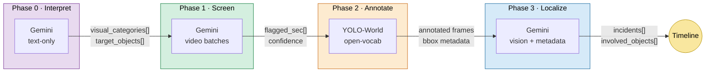
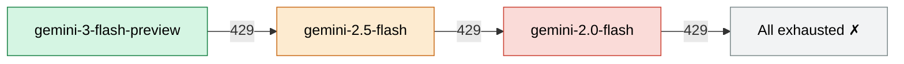
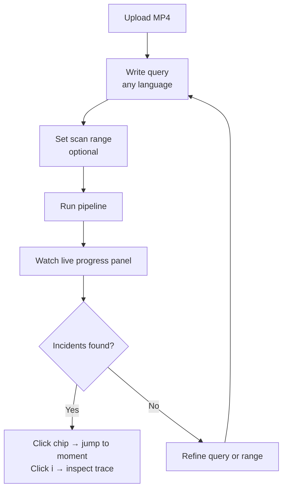

<p align="center"><strong>SCAMTIFY.</strong> <code>GEMINI × YOLO-WORLD</code></p>

<h1 align="center">Scamtir — AI Video Intelligence Console</h1>

<p align="center">
  <em>Ask any video anything, in any language. Multilingual natural-language queries → frame-accurate incident timelines.</em>
</p>

<p align="center">
  
  
  
  
  
</p>

---

## What it does

Type `"อุบัติเหตุ"` (or `"person in red shirt on motorcycle"`, or any free-text query in any language). Scamtir scans your video and returns a timeline of confirmed incidents with bounding boxes, involved parties, and a per-incident inspection trace showing exactly what each AI phase saw.

Built for the **Thailand DOH Innovation Hackathon 2026**. Originally targeted at highway camera footage; the architecture is general.

---

## How it works (4-phase pipeline)



| Phase | Engine | What it does |
|---|---|---|
| **0 — Interpret** | Gemini (text-only) | Expand broad/multilingual queries (`"อุบัติเหตุ"` → `["vehicle collision", "vehicle hitting barrier", "rollover", "debris", ...]`) and infer YOLO class hints (`"traffic barrier"`, `"guardrail"`, `"debris"`). |
| **1 — Screen** | Gemini (video, parallel 8 s batches) | Find exact seconds where ANY interpreted category occurs. Returns `flagged_sec` + `confidence` + `description`. Up to 4 batches screened concurrently. |
| **2 — Annotate** | YOLO-World (FastAPI backend) | For each flagged window (±5 s padding, hard-capped at 10 s), run YOLO-World @ 3 FPS with dynamic class list from Phase 0. Returns annotated frames + bbox metadata. Windows stream results FIFO — incidents render immediately. |
| **3 — Localize** | Gemini (vision + full detection timeline) | Pinpoint the peak frame for each incident and identify involved parties by role. Even-samples 14 frames, sends full bbox metadata for trajectory reasoning. Falls back to Phase 1 if localizer can't improve. Confidence floor: `max(Phase1 × 0.9, localizer)`. |

### Model fallback

All Gemini calls go through a central `geminiCall()` wrapper. On HTTP 429 (rate limit), the wrapper automatically rotates to the next model in the fallback chain:



- 429'd models get a **60 s cooldown** before being retried.
- Once a fallback succeeds, all subsequent calls start from that model.
- Non-429 errors (auth, bad request) propagate immediately — no false retries.
- The log panel shows which model is active and when a switch happens.

**Why this works:** Gemini understands context and Thai natively but can't draw pixel-perfect boxes; YOLO-World draws boxes but can't reason about events. We use each for what it's good at. The localizer-not-verifier framing in Phase 3 stops the pipeline from discarding Phase 1's confident findings, and the model fallback chain keeps the pipeline running through rate limits.

For the full design rationale, see [docs/PIPELINE.md](docs/PIPELINE.md).

---

## Quick start

You need **two processes** running:

### 1. Frontend (`:5173`)

```bash
cd Scamtir
pnpm install
pnpm dev
```

### 2. YOLO backend (`:8000`)

```bash
pip install ultralytics fastapi uvicorn opencv-python tqdm
python hybrid_backend.py
```

First run downloads `yolov8s-worldv2.pt` (~26 MB) and loads YOLO-World (~30 s).

### 3. API key

Open `http://localhost:5173`, paste your Gemini API key in the modal (stored in `localStorage`), or set `VITE_GEMINI_API_KEY` in `.env.local` to skip the prompt. Get one at [ai.google.dev](https://ai.google.dev).

---

## Using it



1. **Upload a video** — drag/drop an MP4 into the upload zone (>5 MB auto-compressed to 360p @ 2 FPS in-browser via FFmpeg WASM).
2. **Write a query** — free-text, any language. Or click a preset.
3. **Set scan range** — start/end seconds (defaults: full video).
4. **Run pipeline** — watch the live progress panel: Phase 0 logs expanded categories, Phase 1 streams flagged moments, Phase 2 reports YOLO detections per window (FIFO — incidents appear as they're found), Phase 3 confirms incidents.
5. **Inspect** — each incident chip has an info button that opens a modal showing:
   - Query interpretation (Phase 0)
   - Phase 1 flagged moments with confidence
   - Phase 2 YOLO annotated frame thumbnails
   - Phase 3 involved objects with bbox coordinates and roles
   - Collapsible raw Gemini JSON response

---

## Project structure

```
Scamtir/
├── README.md                    ← you are here
├── docs/
│   ├── PIPELINE.md              ← 4-phase architecture rationale + failed designs
│   ├── GEMINI-API.md            ← Gemini File API behavior, token costs
│   └── ROADMAP.md               ← hackathon phases, market expansion
│
├── src/                         ← Frontend (React + TypeScript + Vite)
│   ├── App.tsx                  ←   Pipeline logic + UI + inspector modal
│   ├── App.css                  ←   All styles
│   └── main.tsx                 ←   React entry
│
├── hybrid_backend.py            ← Backend (FastAPI + YOLO-World)
│                                  POST /yolo_detect — accepts dynamic classes
│
├── yolov8s-worldv2.pt           ← YOLO-World model weights (auto-downloaded)
├── package.json, pnpm-lock.yaml, vite.config.ts, tsconfig.*.json
├── .env.example                 ← VITE_GEMINI_API_KEY template
└── public/
```

---

## Tech stack

| Layer | Tech | Notes |
|---|---|---|
| Frontend | React 19 · TypeScript · Vite | Single-file app (`App.tsx`), no router |
| Video compression | `@ffmpeg/ffmpeg` (WebAssembly) | Transcodes >5 MB videos to 360p @ 2 FPS in-browser before upload |
| Multimodal AI | Gemini API (3 Flash → 2.5 Flash → 2.0 Flash fallback) | Phase 0/1/3; uses File API + `videoMetadata` startOffset/endOffset for chunked screening. Auto-rotates models on 429. |
| Object detection | YOLO-World (`yolov8s-worldv2.pt`) via `ultralytics` | Phase 2; open-vocabulary — accepts arbitrary text classes from Phase 0 |
| Backend | FastAPI · OpenCV · uvicorn | Stateless YOLO endpoint, serial frame processing |
| Bbox rendering | ResizeObserver + `object-fit: contain` | Pixel-accurate overlay positioning regardless of aspect ratio |

---

## Pipeline constants

| Constant | Value | Purpose |
|---|---|---|
| `BATCH_SIZE_SEC` | 8 s | Phase 1 screening chunk length |
| `PADDING_SEC` | 5 s | ±padding around flagged seconds for YOLO windows |
| `MAX_WINDOW_SEC` | 10 s | Hard cap per YOLO call — longer windows are split into chunks |
| `SCREEN_CONCURRENCY` | 4 | Max parallel Gemini screening calls |
| `YOLO_WINDOW_FPS` | 3 | Phase 2 frame extraction rate |
| `REASONING_FRAME_BUDGET` | 14 | Even-sampled frames sent to Phase 3 per window |
| `MODEL_COOLDOWN_MS` | 60 000 ms | Skip a 429'd model for 60 s before retrying |

---

## Documentation

- **[docs/PIPELINE.md](docs/PIPELINE.md)** — Why we ended up with this 4-phase architecture, what previous designs failed, and the exact prompts each phase uses.
- **[docs/GEMINI-API.md](docs/GEMINI-API.md)** — Gemini File API behavior, 1 FPS sampling, token costs, frame-precision limits.
- **[docs/ROADMAP.md](docs/ROADMAP.md)** — Hackathon implementation phases, market expansion plan, future R&D priorities.

---

<p align="center"><sub>&copy; 2026 Scamtify AI Systems &middot; Built for DOH Innovation Hackathon 2026</sub></p>
