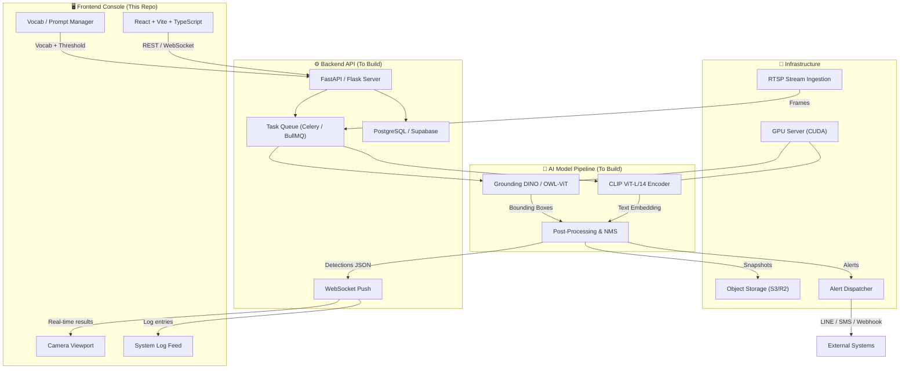
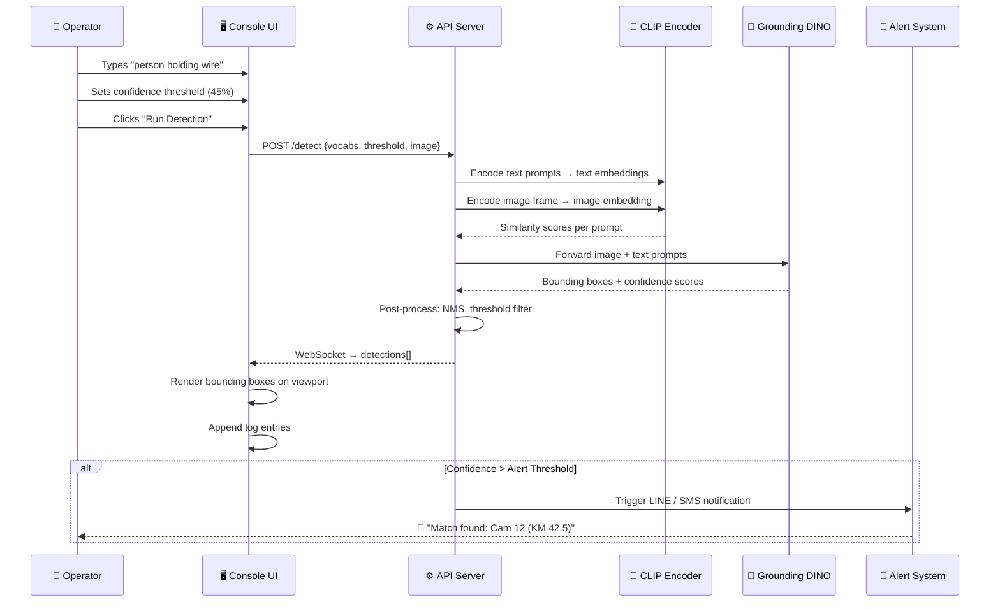
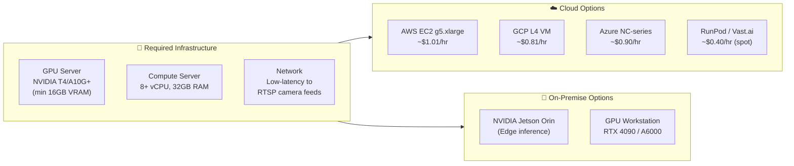
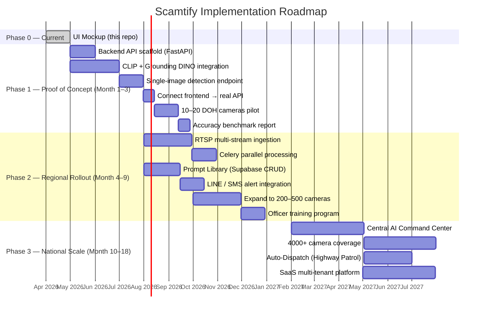
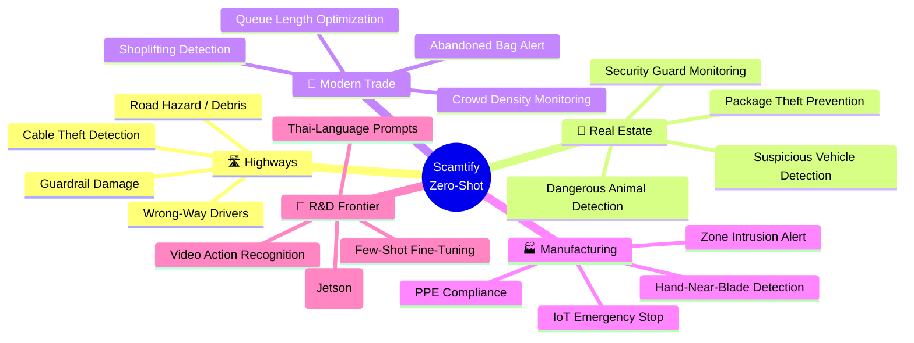

<p align="center">
  <strong>SCAMTIFY.</strong> <code>ZERO-SHOT</code>
</p>

<h1 align="center">Scamtir — Zero-Shot Sentinel Console</h1>

<p align="center">
  <em>Language-driven camera AI. Stop retraining models — start detecting immediately.</em>
</p>

<p align="center">
  
  
  
  
</p>

---

## 📋 Current Status

| Layer | Status | Description |
|---|---|---|
| **Frontend Console** | ✅ Complete | React + TypeScript UI mockup — 70/30 split viewport with detection console |
| **Vocab / Prompt System** | ✅ Complete | Text input, tag management, preset quick-prompts, confidence slider |
| **Detection Simulation** | ✅ Complete | Mock CLIP inference pipeline with bounding box overlays and log feed |
| **Backend API** | ❌ Not Started | FastAPI / Flask inference server for real Zero-Shot models |
| **AI Model Pipeline** | ❌ Not Started | CLIP + Grounding DINO / OWL-ViT integration |
| **RTSP Stream Ingestion** | ❌ Not Started | Multi-camera RTSP parallel processing pipeline |
| **Alert System** | ❌ Not Started | LINE / SMS / Webhook notification dispatcher |
| **Prompt Library / DB** | ❌ Not Started | Supabase / PostgreSQL prompt + detection history storage |

> **TL;DR** — The frontend mockup is 100% functional. Everything below the UI layer (model inference, stream processing, alerting) needs to be built.

---

## 🏗️ System Architecture

The full Scamtify stack consists of three major tiers: the **Frontend Console**, the **Backend Inference API**, and the **AI Model Pipeline**. Here's how they connect:



---

## 🔬 Zero-Shot Detection Pipeline

The core innovation of Scamtify is the **text-to-detection** pipeline. Instead of training a model on thousands of labeled images, operators simply type what they want to detect in natural language.



---

## 🧰 What You Need to Build This

### Infrastructure Requirements



### Detailed Resource Breakdown

| Resource | Minimum Spec | Recommended | Purpose |
|---|---|---|---|
| **GPU** | NVIDIA T4 (16GB) | A10G / A100 (24–80GB) | Model inference (CLIP + Grounding DINO) |
| **CPU** | 8 vCPU | 16+ vCPU | RTSP decoding, pre/post-processing |
| **RAM** | 32 GB | 64 GB | Frame buffers, model weights cache |
| **Storage** | 100 GB SSD | 500 GB NVMe | Model weights (~5 GB), frame cache, logs |
| **Network** | 100 Mbps | 1 Gbps | RTSP streams (~4 Mbps per 1080p cam) |
| **CUDA** | 11.8+ | 12.x | PyTorch / ONNX Runtime GPU backend |

### Software Stack

| Layer | Technology | Why |
|---|---|---|
| **Frontend** | React + Vite + TypeScript | Already built (this repo) |
| **Backend API** | Python FastAPI | Async, fast, OpenAPI docs, WebSocket support |
| **AI — Classification** | CLIP ViT-L/14 (OpenAI) | Zero-shot text-image similarity, ~76% ImageNet |
| **AI — Detection** | Grounding DINO 1.5 | Open-vocabulary object detection from text prompts |
| **AI — Alternative** | OWL-ViT v2 (Google) | Lighter alternative, runs on T4 |
| **AI Runtime** | PyTorch 2.x + ONNX Runtime | GPU-accelerated inference |
| **Stream Processing** | FFmpeg + OpenCV | RTSP → frame extraction pipeline |
| **Task Queue** | Celery + Redis | Parallel multi-camera processing |
| **Database** | Supabase (PostgreSQL) | Prompt library, detection history, user auth |
| **Object Storage** | AWS S3 / Cloudflare R2 | Detection snapshots & evidence archival |
| **Alerting** | LINE Messaging API + Twilio | Push notifications to patrol officers |
| **Monitoring** | Grafana + Prometheus | GPU utilization, inference latency, uptime |

### Python Dependencies (Backend — To Create)

```
# Core
fastapi>=0.115.0
uvicorn[standard]>=0.30.0
python-multipart>=0.0.9
websockets>=12.0

# AI Models
torch>=2.3.0
torchvision>=0.18.0
transformers>=4.42.0          # Hugging Face (OWL-ViT, CLIP)
open-clip-torch>=2.26.0       # OpenCLIP community checkpoints
groundingdino-py>=0.4.0       # Grounding DINO

# Stream Processing
opencv-python-headless>=4.10.0
ffmpeg-python>=0.2.0

# Task Queue
celery[redis]>=5.4.0

# Database
supabase>=2.7.0

# Alerting
line-bot-sdk>=3.11.0
```

---

## 🗺️ Implementation Roadmap



### Phase 0 — Current State ✅

> **What exists today: This repository.**

- [x] React + TypeScript + Vite frontend
- [x] 70/30 split layout (viewport + console)
- [x] Text-to-detection vocabulary manager
- [x] Quick preset system (Cable Theft, Road Hazard, Traffic Anomaly, Safety Compliance)
- [x] Confidence threshold slider
- [x] Mock CLIP inference simulation with bounding box overlays
- [x] Real-time system log feed
- [x] Image upload + grid/scan overlays
- [ ] No real AI model connected — all detections are simulated

### Phase 1 — Proof of Concept (Month 1–3) | Budget: ~500K THB

**Goal:** Connect real Zero-Shot models to the console UI and validate on 10–20 DOH CCTV cameras.

| Task | Stack | Deliverable |
|---|---|---|
| Backend API scaffold | FastAPI + Uvicorn | `/detect`, `/vocab`, `/health` endpoints |
| Model integration | CLIP ViT-L/14 + Grounding DINO 1.5 | Single-image zero-shot detection |
| Frontend ↔ API wiring | WebSocket + REST | Real bounding boxes on viewport |
| GPU provisioning | AWS g5.xlarge or RunPod | 1× A10G instance |
| DOH pilot install | RTSP → FFmpeg | 10–20 cameras, 1 highway section |
| Accuracy report | Python + Jupyter | Precision/Recall vs. manual annotation |

### Phase 2 — Regional Rollout (Month 4–9) | Budget: ~2.5M THB

**Goal:** Scale to 200–500 cameras across 3–5 highway divisions with production alerting.

| Task | Stack | Deliverable |
|---|---|---|
| Multi-RTSP ingestion | FFmpeg + OpenCV + Celery | Parallel frame extraction at scale |
| Prompt Library | Supabase + CRUD API | Saved, reusable detection prompts per zone |
| Alert system | LINE Messaging API + SMS | Real-time push to patrol officers |
| Dashboard analytics | Grafana + Prometheus | Detection volume, latency, GPU utilization |
| Officer training | Workshops + docs | Field training for 50+ officers |

### Phase 3 — National Scale (Month 10–18) | Budget: ~8M THB

**Goal:** Cover 4,000+ cameras nationwide, Central AI Command Center, SaaS expansion.

| Task | Stack | Deliverable |
|---|---|---|
| Central Command Center | React dashboard + map | National real-time monitoring |
| Auto-Dispatch | Integration with Highway Patrol | Automated incident → patrol assignment |
| Multi-tenant SaaS | Auth, billing, tenant isolation | Platform for other agencies & private sector |
| Edge inference | NVIDIA Jetson Orin | On-premise option for sensitive sites |

---

## 🔮 Future Work & Market Expansion



### Technical R&D Priorities

1. **Video-level Zero-Shot Action Recognition** — Move beyond single-frame to temporal action detection (e.g., "person climbing fence" over 3 seconds)
2. **Thai-Language Prompt Support** — Fine-tune CLIP text encoder for Thai prompts ("คนกำลังถือสายไฟ") via multilingual CLIP or translation layer
3. **Few-Shot Fine-Tuning Loop** — Allow operators to correct false positives/negatives → auto fine-tune adapter layers (LoRA) without full retraining
4. **Edge Deployment** — Quantize models (INT8/FP16) for NVIDIA Jetson Orin Nano — run inference at the camera level, send alerts only
5. **Federated Prompt Sharing** — Cross-agency prompt library marketplace (e.g., DOH shares "road debris" prompts with DLT)

---

## 🚀 Getting Started

### Prerequisites

- Node.js ≥ 18
- pnpm ≥ 8

### Install & Run

```bash
cd Scamtir
pnpm install
pnpm run dev
# → http://localhost:5173/
```

### Usage

1. **Upload an image** — Click the upload zone or drag & drop a JPG/PNG/WebP
2. **Add detection prompts** — Type what you want to detect (e.g., `"fallen tree on road"`)
3. **Or load a preset** — Click Cable Theft / Road Hazard / Traffic Anomaly / Safety Compliance
4. **Adjust confidence** — Slide the threshold (default 45%)
5. **Run detection** — Click the gradient button and watch the simulated pipeline in the log feed

> ⚠️ **Note:** All detections are currently simulated. Connecting to real CLIP / Grounding DINO models requires the backend (Phase 1).

---

## 📁 Project Structure

```
Scamtir/
├── index.html              # Entry HTML with Inter + JetBrains Mono fonts
├── package.json            # pnpm project config
├── vite.config.ts          # Vite dev server config
├── tsconfig.json           # TypeScript config
├── src/
│   ├── main.tsx            # React entry point
│   ├── App.tsx             # Main app — viewport + console layout
│   ├── App.css             # All component styles (70/30 layout)
│   └── index.css           # Design system tokens + animations
└── public/
    └── vite.svg            # Favicon
```

---

## 📚 References

- [CLIP — Learning Transferable Visual Models (OpenAI, 2021)](https://arxiv.org/abs/2103.00020)
- [Grounding DINO — Marrying DINO with Grounded Pre-Training (2023)](https://arxiv.org/abs/2303.05499)
- [OWL-ViT — Simple Open-Vocabulary Object Detection (Google, 2022)](https://arxiv.org/abs/2205.06230)
- [DOH Highway Traffic Camera System](https://www.doh.go.th)

---

<p align="center">
  <sub>© 2026 Scamtify Zero-Shot Systems · Built for DOH Innovation Hackathon</sub>
</p>
