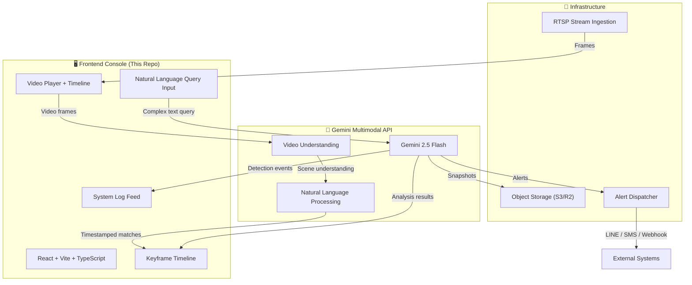
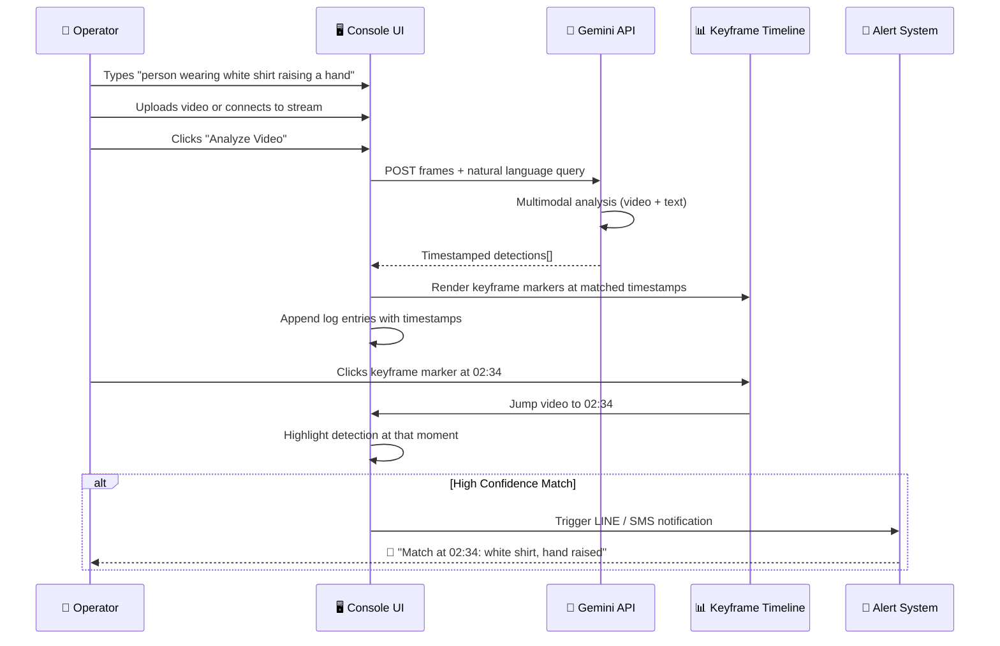
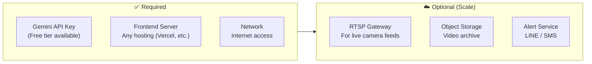
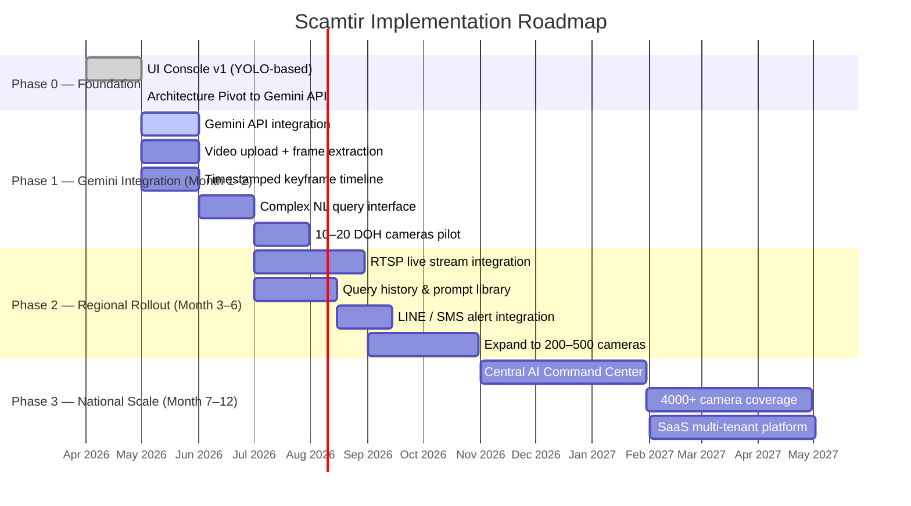
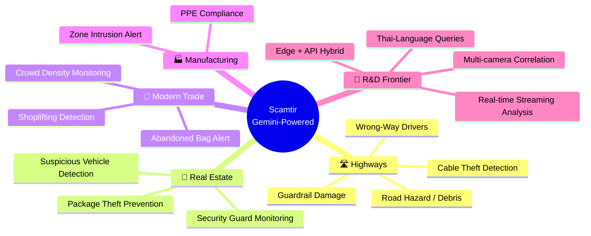

<p align="center">
  <strong>SCAMTIFY.</strong> <code>GEMINI-POWERED</code>
</p>

<h1 align="center">Scamtir — AI Video Intelligence Console</h1>

<p align="center">
  <em>Ask your camera anything. Complex natural language queries on streaming video — powered by Gemini.</em>
</p>

<p align="center">
  
  
  
  
</p>

---

## 📋 Current Status

| Layer | Status | Description |
|---|---|---|
| **Frontend Console** | ✅ Complete | React + TypeScript UI — video player with timestamped keyframe timeline |
| **Natural Language Query** | ✅ Complete | Complex text queries: "person wearing white shirt raising a hand" |
| **Keyframe Timeline** | ✅ Complete | Visual timeline with event markers, timestamps, and jump-to-moment |
| **Gemini API Integration** | 🔧 In Progress | Gemini multimodal API for video frame analysis |
| **Video Upload / Stream** | ✅ Complete | Upload video files or connect to live camera streams |
| **Detection Log Feed** | ✅ Complete | Real-time system log with detection events and confidence scores |
| **RTSP Stream Ingestion** | ❌ Not Started | Multi-camera RTSP parallel processing pipeline |
| **Alert System** | ❌ Not Started | LINE / SMS / Webhook notification dispatcher |

> **TL;DR** — The UI now features a streaming video player with a **timestamped keyframe timeline** and **complex natural language queries** powered by **Gemini API**. No more basic YOLO — this understands "person in red shirt driving a motorcycle" out of the box.

---

## 🏗️ System Architecture

The new Scamtir architecture is dramatically simplified by leveraging **Gemini's multimodal API** directly. No custom model training, no GPU servers — just powerful natural language video understanding out of the box.



### Why Gemini API?

| Approach | Old (YOLO / CLIP) | New (Gemini API) |
|---|---|---|
| **Query Complexity** | Simple object labels only | Full natural language: "person in red shirt driving motorcycle" |
| **Setup Time** | Weeks (GPU, model training) | Hours (API key + prompt) |
| **Infrastructure** | GPU server required ($1+/hr) | API calls only |
| **Accuracy** | Limited to trained classes | Understands context, actions, clothing, interactions |
| **Demo Speed** | Slow to build convincing demo | Immediate, impressive results |

---

## 🔬 Gemini Video Intelligence Pipeline

The core innovation is the **natural language video query** pipeline. Operators describe exactly what they're looking for in plain language — no more basic object labels.



---

## 🧰 What You Need to Build This
## 🧰 What You Need to Build This

### Infrastructure Requirements (Simplified!)



> **Key Insight:** By using Gemini API, we eliminated the need for GPU servers, model training, and complex ML infrastructure. The entire system runs on API calls.

### Software Stack

| Layer | Technology | Why |
|---|---|---|
| **Frontend** | React + Vite + TypeScript | Already built (this repo) |
| **AI Engine** | Gemini 2.5 Flash API | Multimodal video understanding, complex NL queries |
| **Video Processing** | HTML5 Video + Canvas API | Frame extraction in the browser |
| **Stream Processing** | FFmpeg (optional) | RTSP → frame extraction for live cameras |
| **Database** | Supabase (PostgreSQL) | Query history, detection logs |
| **Object Storage** | AWS S3 / Cloudflare R2 | Video archive & evidence snapshots |
| **Alerting** | LINE Messaging API + Twilio | Push notifications to patrol officers |

---

## 🗺️ Implementation Roadmap



### Phase 0 — Foundation ✅

> **Architecture pivot: YOLO → Gemini API**

- [x] React + TypeScript + Vite frontend
- [x] Video player with streaming support
- [x] Timestamped keyframe timeline with event markers
- [x] Natural language query input (complex queries)
- [x] Query preset system for common scenarios
- [x] Real-time system log feed
- [x] Architecture decision: Gemini API over custom YOLO pipeline
- [ ] Gemini API key integration (next step)

### Phase 1 — Gemini Integration (Month 1–2) | Budget: ~100K THB

**Goal:** Wire Gemini API for real video analysis with natural language queries.

| Task | Stack | Deliverable |
|---|---|---|
| Gemini API integration | Gemini 2.5 Flash | Video frame analysis endpoint |
| Frame extraction | Canvas API | Extract key frames from uploaded video |
| Keyframe matching | Gemini + Timeline | Timestamped detection events on timeline |
| NL Query engine | Gemini multimodal | "Person in red shirt on motorcycle" → timestamps |
| DOH pilot | RTSP → Frames | 10–20 cameras, 1 highway section |

### Phase 2 — Regional Rollout (Month 3–6) | Budget: ~1.5M THB

**Goal:** Scale to 200–500 cameras with production alerting.

| Task | Stack | Deliverable |
|---|---|---|
| RTSP live streams | FFmpeg + WebSocket | Real-time camera feed ingestion |
| Query Library | Supabase + CRUD API | Saved, reusable queries per zone |
| Alert system | LINE Messaging API + SMS | Real-time push to patrol officers |
| Dashboard analytics | Grafana + Prometheus | Query volume, response times |

### Phase 3 — National Scale (Month 7–12) | Budget: ~5M THB

**Goal:** Cover 4,000+ cameras nationwide, Central AI Command Center.

| Task | Stack | Deliverable |
|---|---|---|
| Central Command Center | React dashboard + map | National real-time monitoring |
| Auto-Dispatch | Integration with Highway Patrol | Automated incident → patrol assignment |
| Multi-tenant SaaS | Auth, billing, tenant isolation | Platform for other agencies & private sector |

---

## 🔮 Future Work & Market Expansion



### Technical R&D Priorities

1. **Real-time Streaming Analysis** — Continuous frame-by-frame Gemini analysis on live RTSP streams
2. **Thai-Language Query Support** — Full Thai natural language queries ("คนใส่เสื้อแดงขับมอเตอร์ไซค์") via Gemini's multilingual capability
3. **Multi-camera Correlation** — Cross-reference detections across multiple cameras to track subjects
4. **Edge + API Hybrid** — Use lightweight edge models for pre-filtering, Gemini API for complex queries
5. **Query DSL** — Build a domain-specific query language for power users beyond natural language

---

## 🚀 Getting Started

### Prerequisites

- Node.js ≥ 18
- pnpm ≥ 8
- Gemini API key (get one at [ai.google.dev](https://ai.google.dev))

### Install & Run

```bash
cd Scamtir
pnpm install
pnpm run dev
# → http://localhost:5173/
```

### Usage

1. **Upload a video** — Click the upload zone or drag & drop an MP4/WebM file
2. **Write a natural language query** — Describe exactly what you're looking for (e.g., `"person wearing white shirt raising a hand"`)
3. **Or load a preset** — Click one of the quick query presets
4. **Analyze** — Click the "Analyze Video" button to process with Gemini
5. **Browse keyframes** — Click markers on the timeline to jump to detected moments

> ⚠️ **Note:** Gemini API integration is in progress. The UI is fully functional with simulated keyframe data for demo purposes.

---

## 📁 Project Structure

```
Scamtir/
├── index.html              # Entry HTML with Inter + JetBrains Mono fonts
├── package.json            # pnpm project config
├── vite.config.ts          # Vite dev server config
├── tsconfig.json           # TypeScript config
├── src/
│   ├── main.tsx            # React entry point
│   ├── App.tsx             # Main app — video player + query console + timeline
│   ├── App.css             # All component styles
│   └── index.css           # Design system tokens + animations
└── public/
    └── vite.svg            # Favicon
```

---

## 📚 References

- [Gemini API — Multimodal AI (Google DeepMind)](https://ai.google.dev/gemini-api)
- [Gemini Vision — Video Understanding](https://ai.google.dev/gemini-api/docs/vision)
- [DOH Highway Traffic Camera System](https://www.doh.go.th)
- [CLIP — Learning Transferable Visual Models (OpenAI, 2021)](https://arxiv.org/abs/2103.00020) *(legacy reference)*

---

<p align="center">
  <sub>© 2026 Scamtify AI Systems · Built for DOH Innovation Hackathon</sub>
</p>