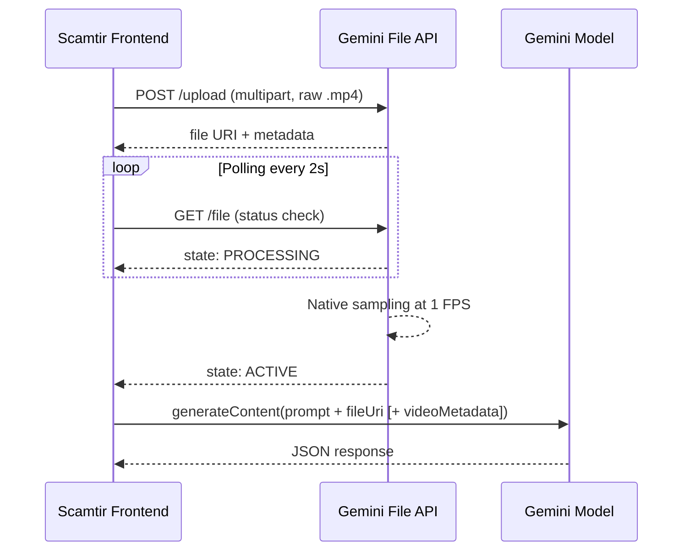
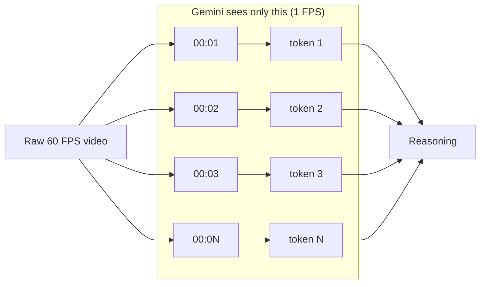

# Gemini File API — Behavior Reference

> Reference for how Gemini's File API processes video. Useful for understanding token costs and the frame-precision trade-offs that shaped Scamtir's pipeline architecture.

---

## 1. Upload + processing flow



### What happens during PROCESSING

The Gemini File API decodes the video and resamples it at a fixed **1 frame per second**. Every subsequent `generateContent` call against this `fileUri` reads from those pre-extracted frames. The original raw file is discarded after processing.

This means:
- Re-querying the same video doesn't re-decode anything (very fast follow-ups).
- The video is cached server-side until its TTL expires (~48 hours).
- All temporal grounding the model can do is at 1-second resolution.

---

## 2. Native 1 FPS sampling — the precision floor



If you upload a 60 FPS video, Gemini sees 1 of every 60 frames. **Sub-second events that resolve in <1 second can be missed entirely** — Gemini literally never receives those frames.

For Scamtir, this is why we use YOLO-World (Phase 2) for frame-accurate localization. Gemini handles semantic understanding at 1 FPS; YOLO handles 3 FPS bbox precision on the windows Gemini flagged.

---

## 3. Window-bounded inference via `videoMetadata`

```js
{
  fileData: { fileUri, mimeType },
  videoMetadata: {
    startOffset: "12s",
    endOffset:   "20s"
  }
}
```

Once a video is `ACTIVE`, you can constrain inference to any `[startOffset, endOffset]` slice. Scamtir uses this to chop the video into 8-second batches for parallel screening (Phase 1) without re-uploading.

The model still only sees pre-sampled 1 FPS frames inside that window — `videoMetadata` is a windowing API, not a re-sampling API.

---

## 4. Token consumption

Resolution doesn't affect token count — Gemini resizes 1-FPS samples internally.

| Component | Rate |
|---|---|
| Video tokens | ~263 per second |
| Audio tokens | ~32 per second |
| **Total** | **~295 tokens / second of video** |

| Video Duration | Video | Audio | Total |
|---|---|---|---|
| 1 second | 263 | 32 | **295** |
| 1 minute | 15,780 | 1,920 | **17,700** |
| 10 minutes | 157,800 | 19,200 | **177,000** |

### Cost estimates (USD; 1 USD ≈ 34 THB)

**Gemini 3 Flash** ($0.50 / 1M input tokens):

| Duration | USD | THB |
|---|---|---|
| 1 second | $0.00015 | 0.005 |
| 1 minute | $0.0089 | 0.30 |
| 10 minutes | $0.0885 | 3.01 |

**Gemini 3 Pro** ($2.00 / 1M input tokens):

| Duration | USD | THB |
|---|---|---|
| 1 second | $0.0006 | 0.02 |
| 1 minute | $0.035 | 1.20 |
| 10 minutes | $0.354 | 12.04 |

(Output tokens billed separately; usually tiny for our JSON-mode responses.)

### Why this is cheap

If we manually extracted and uploaded 30 FPS instead of using the File API's 1 FPS native sampling, a 1-minute video would consume **~530k tokens** — 30× more cost, frequently busting the context window.

Phase 2's frame-by-frame YOLO is what gives us 3 FPS precision without paying the 30 FPS Gemini bill.

---

## 5. Strict JSON enforcement

All Scamtir Gemini calls set:

```js
generationConfig: {
  responseMimeType: "application/json",
  temperature: 0.2
}
```

This enforces parseable JSON output and keeps the model deterministic enough that confidence thresholds mean something. Schema is enforced via prompt — Gemini does not yet support hard schema validation.

---

## 6. Frame precision limits — recap

| Constraint | Source | Mitigation |
|---|---|---|
| 1 FPS sampling | File API native | Use YOLO Phase 2 for sub-second precision |
| Sub-second events missed | 1 FPS sampling | Phase 0 query interpretation widens what Phase 1 looks for |
| Server-side cache | File API TTL ~48h | Frontend memoizes `fileUri` per session |
| Token cost scales with duration only (not resolution) | 1 FPS internal resize | Compress to 360p @ 2 FPS client-side before upload to shrink the upload payload, not the inference cost |

---

## References

- [Gemini API — Vision (video understanding)](https://ai.google.dev/gemini-api/docs/vision)
- [Gemini API — File API](https://ai.google.dev/gemini-api/docs/files)
- [Gemini API — Pricing](https://ai.google.dev/pricing)
