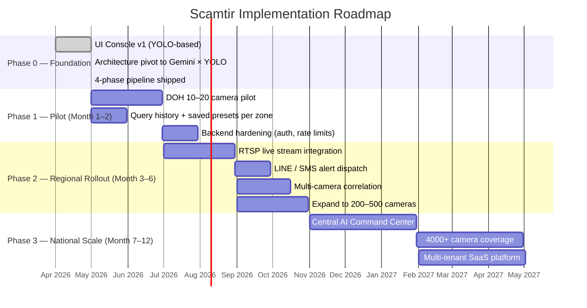
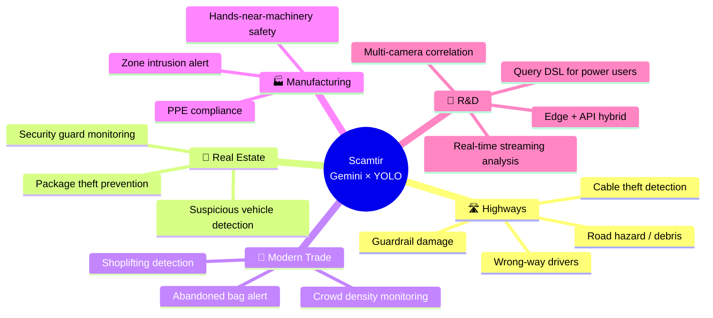

# Roadmap & Market Expansion

> Hackathon implementation phases and longer-term direction. Tech architecture lives in [PIPELINE.md](PIPELINE.md).

---

## Phase progression

---

## Phase 0 — Foundation ✅ (done)

**Status:** Architecture proven, ready for pilot.

- [x] React + TypeScript + Vite frontend
- [x] FastAPI + YOLO-World backend
- [x] Gemini File API integration with `videoMetadata` chunked screening
- [x] 4-phase pipeline (Phase 0/1/2/3)
- [x] Multi-incident timeline with inspector modal
- [x] Aspect-ratio-correct bounding box rendering
- [x] Multilingual queries (Thai natively supported via Phase 0 interpretation)
- [x] Confidence-threshold filtering

---

## Phase 1 — Pilot · Month 1–2 · Budget ~100K THB

**Goal:** Run the current pipeline against a real DOH highway camera section.

| Task | Stack | Deliverable |
|---|---|---|
| 10–20 camera pilot | RTSP → frame buffer → Scamtir | Live forensic search across one highway segment |
| Query preset library | Supabase + simple CRUD | Operator-saved queries per zone/route |
| Backend hardening | FastAPI + auth middleware | API keys, per-user rate limits, audit log |
| Cost telemetry | Custom dashboard | Token usage per query, $ per incident detected |

---

## Phase 2 — Regional Rollout · Month 3–6 · Budget ~1.5M THB

**Goal:** Scale to 200–500 cameras with production alerting.

| Task | Stack | Deliverable |
|---|---|---|
| RTSP live ingestion | FFmpeg + WebSocket buffer | Real-time camera feed, ring-buffer of last N minutes |
| LINE / SMS alerts | LINE Messaging API + Twilio | Push to patrol officers within seconds of detection |
| Multi-camera correlation | Cross-camera Phase 0 query reuse | Track a subject across N adjacent cameras |
| Operations dashboard | Grafana + Prometheus | Query volume, p50/p95 latency, alert delivery rates |

---

## Phase 3 — National Scale · Month 7–12 · Budget ~5M THB

**Goal:** 4,000+ cameras nationwide, multi-tenant.

| Task | Stack | Deliverable |
|---|---|---|
| Central AI Command Center | React dashboard + map view | National real-time monitoring console |
| Auto-dispatch | Highway Patrol integration | Detection → automated patrol assignment |
| Multi-tenant SaaS | Auth + billing + tenant isolation | Platform offered to other agencies & private sector |

---

## Market expansion

---

## R&D priorities

1. **Real-time streaming analysis** — continuous Phase 1 screening on rolling RTSP windows; Phase 2/3 only on flagged moments.
2. **Multi-camera correlation** — re-use Phase 0 interpretation across cameras; track a subject by re-running Phase 1 on adjacent feeds.
3. **Edge + API hybrid** — lightweight on-device YOLO at the camera for first-pass filtering; only suspicious windows uploaded to Gemini.
4. **Query DSL** — for power users who want to compose interpretations: `event="collision" subject="vehicle" object="barrier" lighting="night"`.
5. **Active learning loop** — operator feedback on false positives feeds back into Phase 0 interpretation prompts per zone.

---

## Why this approach scales

| Concern | Answer |
|---|---|
| **Cost per camera** | Phase 1 is the expensive Gemini call. With RTSP ring buffers, we only screen new windows (8s each, ~$0.001 each on Flash). |
| **Latency** | Phase 1 returns in ~3–5s for 8s windows; Phase 2 YOLO ~1s; Phase 3 ~3s. End-to-end alert delivery <15s for live streams. |
| **Multilingual ops** | Phase 0 interpretation handles every language Gemini supports — no per-language model. |
| **No GPU infra** | Backend YOLO-World runs comfortably on CPU at 3 FPS. Gemini handles the heavy reasoning. |

See [PIPELINE.md](PIPELINE.md) for the technical architecture and [GEMINI-API.md](GEMINI-API.md) for cost math.
